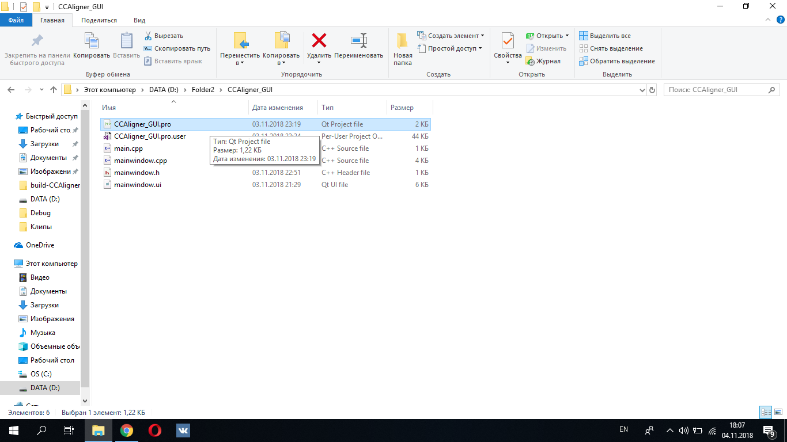
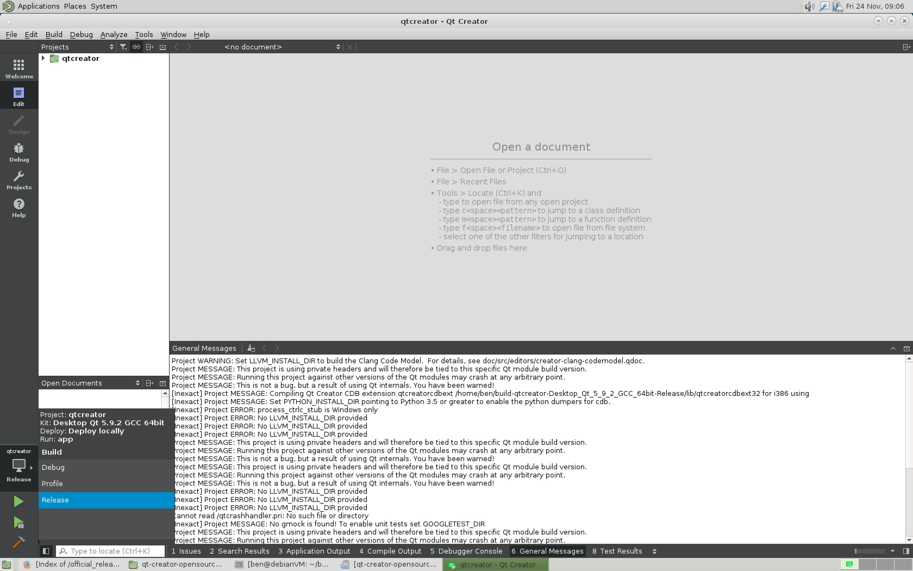
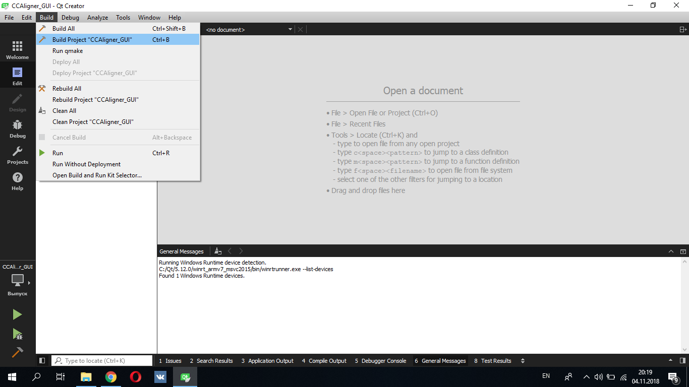
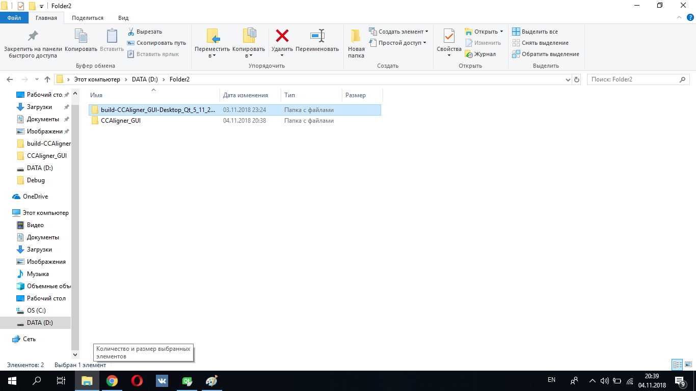
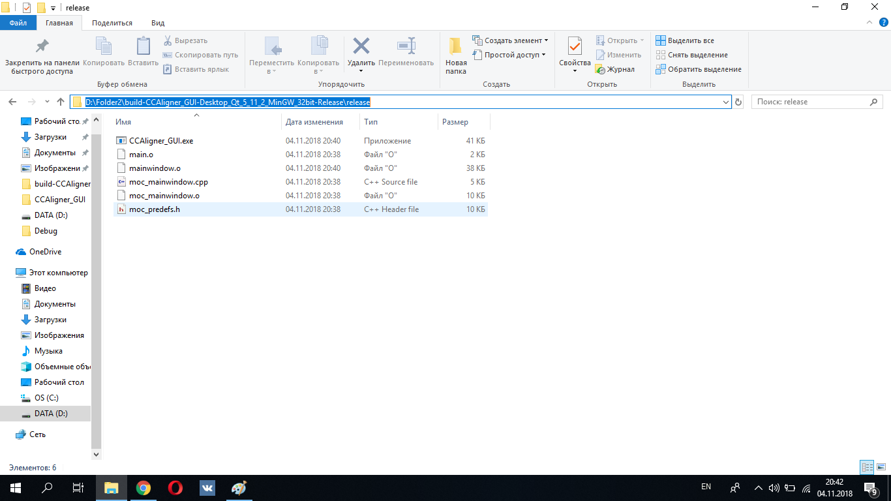
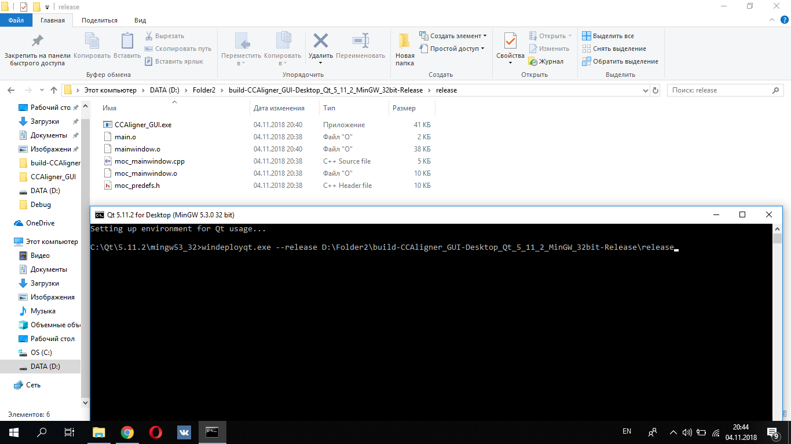
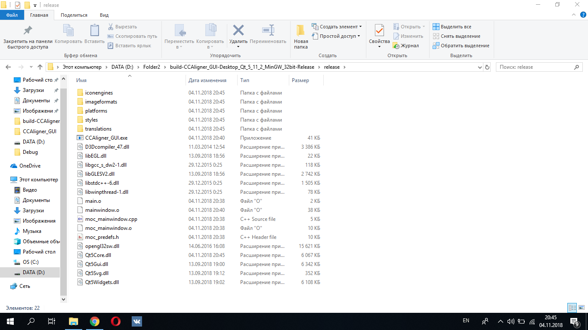

# CCAligner_GUI
CCAligner_GUI is a simple GUI which was written using QT. 

* It supports Linux, Mac OS and Windows.
#### Running CCAligner_GUI
`
To run it you can either compile the application(See compilation guide) or just download binaries.
When you have executable file you have to move it with all dependencies such as *.dll to folder where ccaligner.exe is situated.
Then you can just run CCAligner_GUI.exe.`

#### Compilation guide
1. Install QTCreator on your computer:   [QT Creator link](https://www.qt.io/download) with QT5.
2. Download or clone the repository
3. Go to src folder and open .pro file

4. Make sure that it uses Release mode(If not just change it from debug to release).

5.Then click on build -> build project CCAligner_GUI.

6. Then go to folder where src is situated and choose folder that was created after you built CCAligner_GUI in qt creator and open release folder. Your application must be there.

Note: If you are on Linux or Mac it must already work for you. But if you are on windows read the next points.
7. Then open your QT(not QT creator) in console and write next: windeployqt.exe --release "executable_path"
Here executable path is path to release folder when you CCAligner_GUI.exe is situated. 

8. Finally, you will get all your dependencies in release folder. The you can just move it to the CCAligner executable folder and run.

Note: CCAligner executable must be in same directory as CCAligner_GUI executable.

### Demo video
If you want to see how CCAligner_GUI works without running it you can just download CCAligner_GUI.mp4 from current repository.
